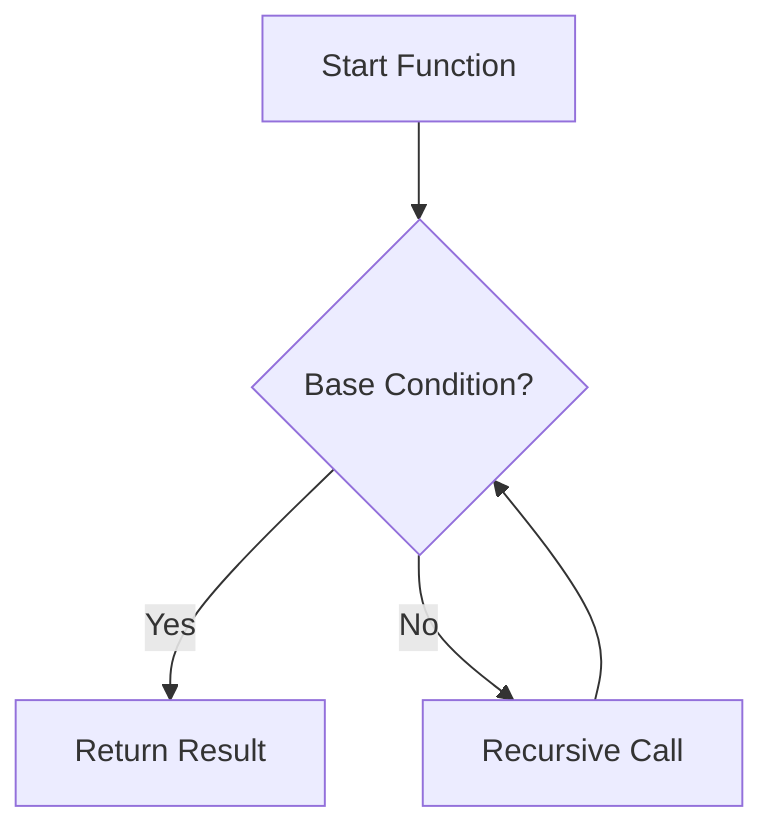

# 🚀 Python Advance Complete Tutorial - Part 2 🐍🔥


---

## 🎬 Preview GIF 🚀


---

# 📚 Table of Contents 📌
- 📖 Introduction
- 📂 Repository Structure
- 📁 Folder Details
- 📜 Notebook Descriptions
- 🧠 Recursion Flowchart
- ⚙️ How to Use
- 🌟 Key Highlights
- 🤝 Contributing
- 📬 Contact

---

# 📖 Introduction ✨
Recursion is when a function calls itself 🔁 until it reaches a base condition.

---

# 📂 Repository Structure 🗂️
```
Python_Advance_Complete_Tutorial_Part_2/
└── Recursion in Python/
```

---

# 📁 Folder Details 📂
📌 **Recursion in Python**

---

# 📜 Notebook Descriptions 📘
- 🔢 Print Numbers 1 to N
- 🔁 Head vs Tail Recursion
- 📊 Recursion & Arrays
- ✅ Check Sorted Array
- 🔍 All Indices
- ➕ Sum of Array
- 🌐 Global List Updates
- 🆕 Return New List
- ⚡ Quick Sort
- 🔀 Merge Sort

---

# 🧠 Recursion Flowchart 📊



---

# 🧩 Example Visualization 🎯

```mermaid
graph TD
    A[f(3)] --> B[f(2)]
    B --> C[f(1)]
    C --> D[f(0)]
    D --> E[Return]
```

---

# ⚙️ How to Use 🛠️
1. Clone repo 📥
2. Open Jupyter 📓
3. Run notebooks ▶️

---

# 🌟 Key Highlights ⭐
✨ Beginner → Advanced  
⚡ Sorting Algorithms  
🧠 Strong Concepts  

---

# 🛡️ Shields & Tech Stack 💻


---

# 🤝 Contributing 💡
Fork 🍴 → Improve 🔧 → PR 🚀

---

# 📬 Contact 📧
Feel free to connect! 😊

---

# 🎉 Happy Coding! 🚀🐍🔥
